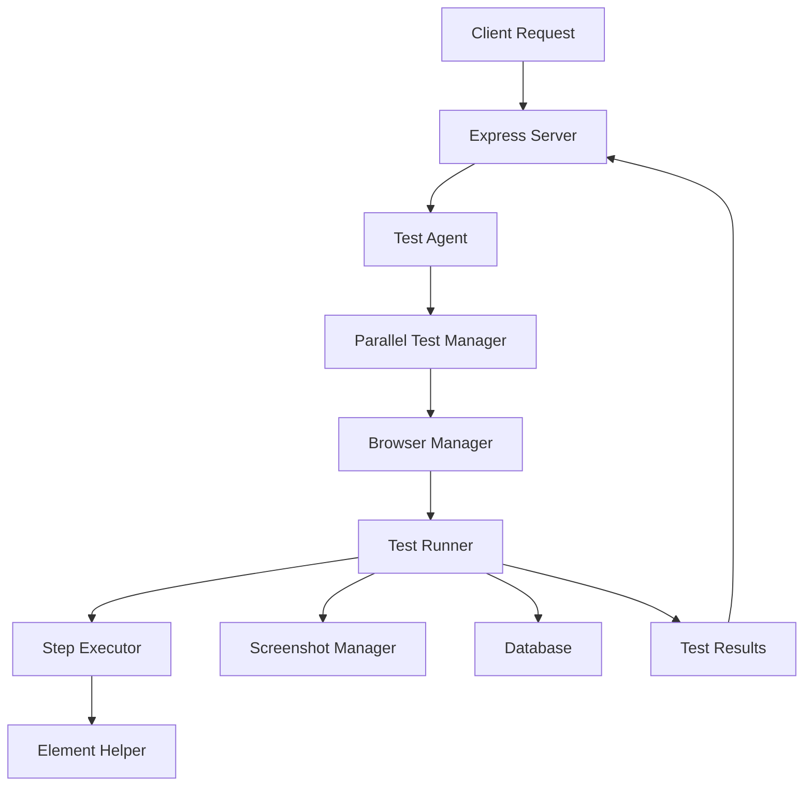

# Playwright Server Agent - Mimari Dokümantasyonu

## 1. Ana Bileşenler

### 1.1. Sunucu Katmanı
- **Express Sunucusu** (`server.js`)
  - HTTP API endpoint'leri
  - WebSocket sunucusu
  - Statik dosya sunumu
  - Hata yönetimi

### 1.2. Test Yürütme Katmanı
- **Test Ajanı** (`services/testAgent.js`)
  - Test yürütmenin ana giriş noktası
  - Test planlarını işleme

- **Paralel Test Yöneticisi** (`services/browser/ParallelTestManager.js`)
  - Çoklu test yürütme
  - İş parçacığı yönetimi
  - Test sonuçlarını toplama

### 1.3. Tarayıcı Otomasyonu Katmanı
- **Tarayıcı Yönetimi** (`services/browser/`)
  - `BrowserManager.js`: Tarayıcı yaşam döngüsü yönetimi
  - `ElementHelper.js`: Element etkileşimleri
  - `ScreenshotManager.js`: Ekran görüntüsü yönetimi
  - `StepExecutor.js`: Test adımlarını yürütme
  - `TestRunner.js`: Test senaryolarını çalıştırma
  - `AntiDetection.js`: Bot algılama önlemleri
  - `PlaywrightTestAdapter.js`: Playwright Test Runner entegrasyonu

### 1.4. Veritabanı Katmanı (`database/`)
- SQLite veritabanı entegrasyonu
- Servisler:
  - `elementService.js`
  - `scenarioService.js`
  - `resultService.js`
  - `testRunService.js`
  - `testResultService.js`
  - `testSuiteService.js` 
  - `webElementService.js`
  - `bugAndConfigService.js`

### 1.5. API Rotaları (`routes/`)
- `api.js`: Ana API rotaları
- `reports.js`: Raporlama endpoint'leri
- `performance.js`: Performans metrikleri
- `status.js`: Durum endpoint'leri

## 2. Destek Bileşenleri

### 2.1. Konfigürasyon Sistemi
- `config.js`: Ana konfigürasyon
- `playwright-server-config.js`: Playwright özel ayarları

### 2.2. Hata Yönetimi
- `services/errors/`: Özel hata sınıfları

### 2.3. Factory Pattern
- `services/factories/`: Tarayıcı factory'leri

## 3. Veri Akışı

## 4. Teknoloji Yığını
- Node.js
- Express 4.18.2
- Playwright 1.40.0
- WebSocket (ws) 8.18.1
- SQLite (better-sqlite3 11.9.1)

## 5. Mimari Notlar

Bu mimari, SOLID prensiplerine uygun, modüler ve genişletilebilir bir yapı sunmaktadır. Özellikle bağımlılık enjeksiyonu ve factory pattern gibi tasarım desenlerinin kullanımı, kodun bakımını ve test edilebilirliğini artırmaktadır.

### Anahtar Özellikler:
- Modüler tasarım
- Bağımlılık enjeksiyonu
- Factory pattern kullanımı
- Test edilebilirlik
- Genişletilebilirlik
- Paralel test yürütme desteği
- Anti-bot önlemleri
- Kapsamlı hata yönetimi
- Performans metrik toplama